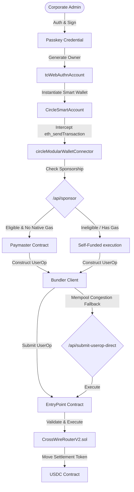
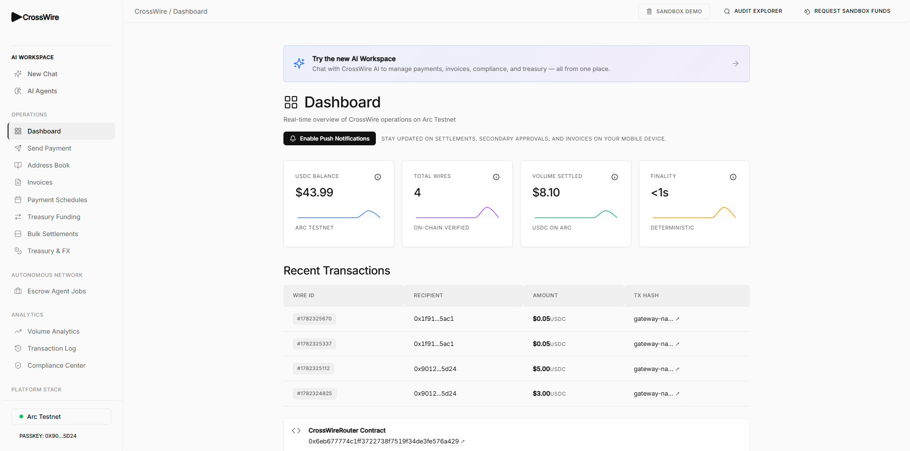
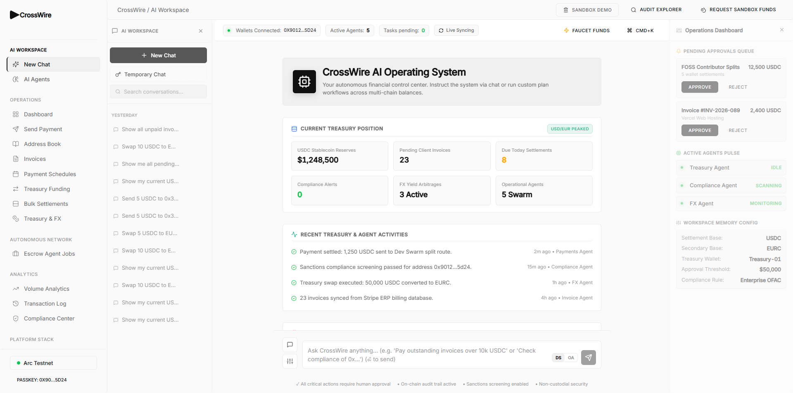
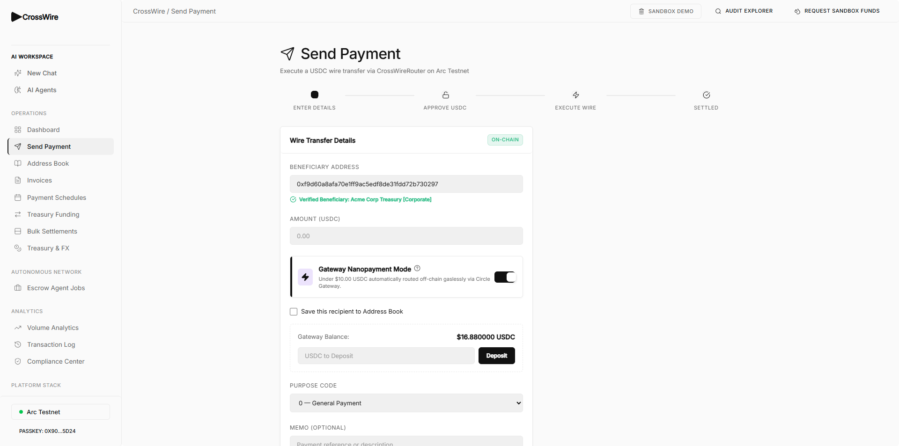
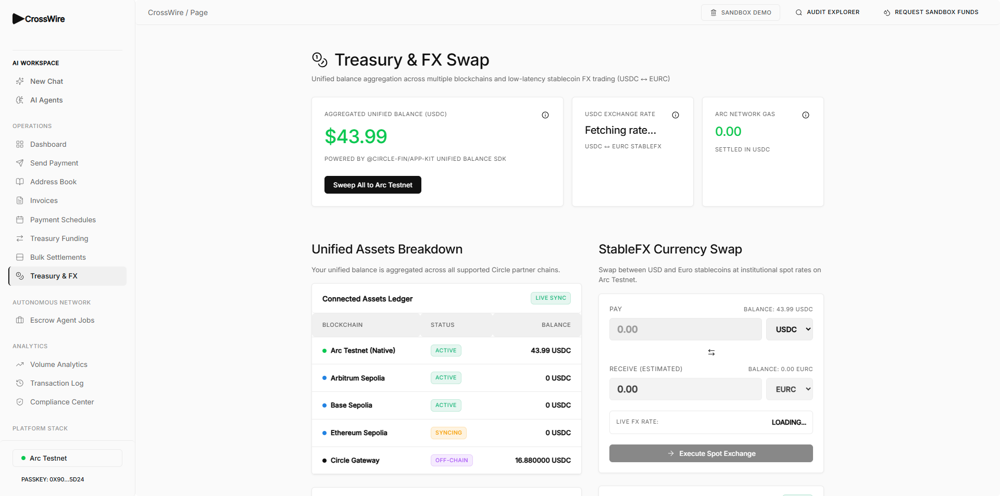
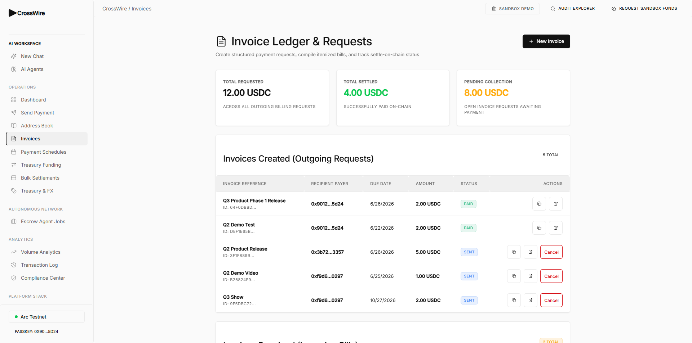
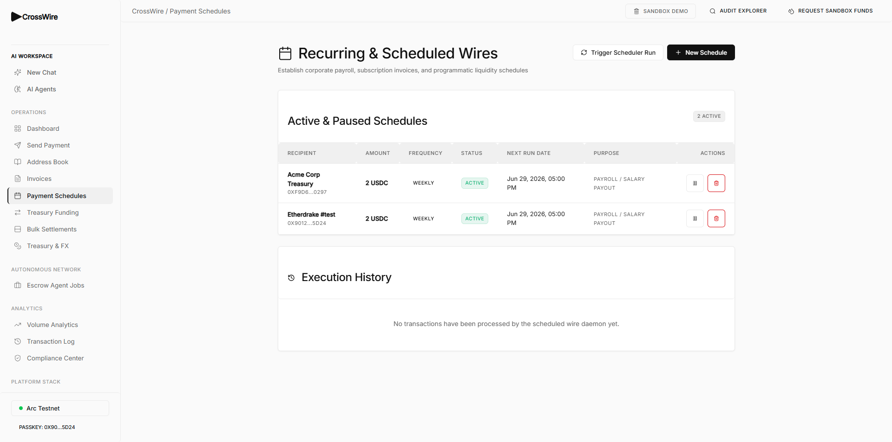
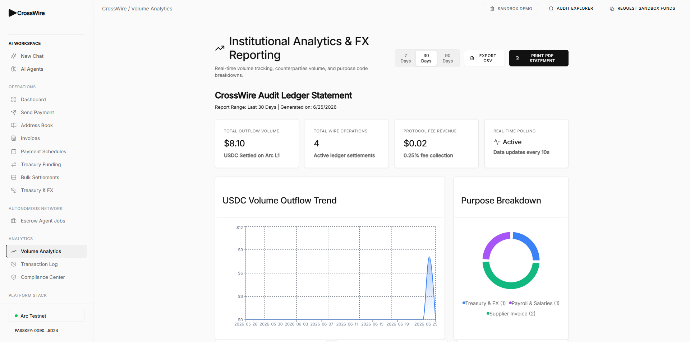
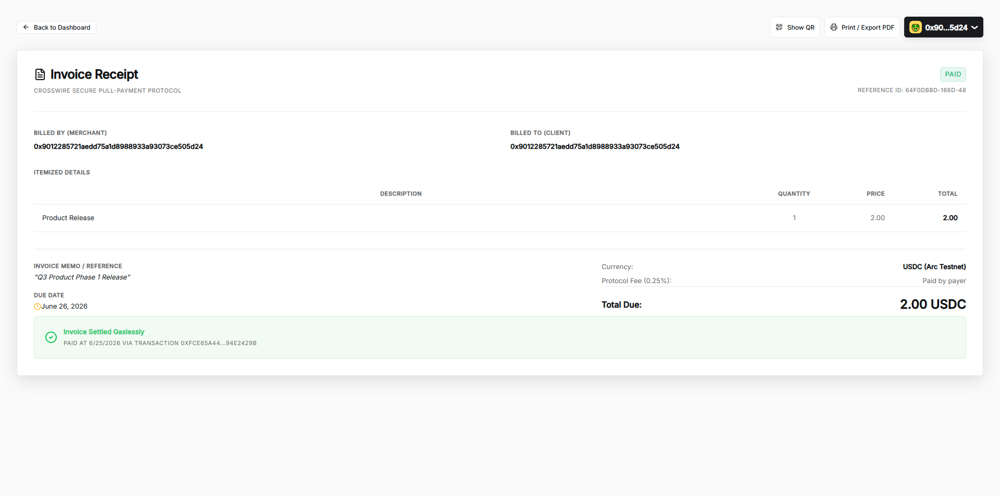
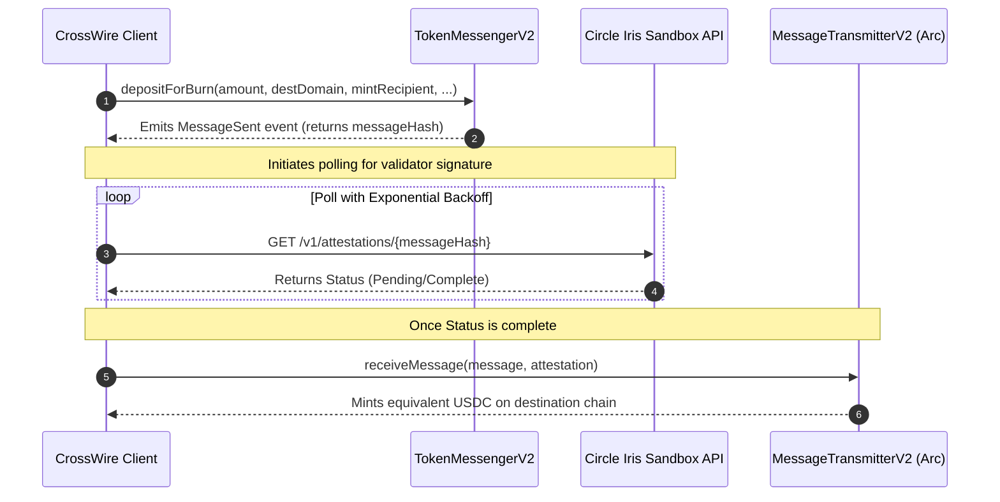

# CrossWire: Institutional-Grade Wire Settlement Protocol on Arc

CrossWire is a production-grade settlement engine that replaces traditional SWIFT cross-border messaging with sub-second USDC settlement on the **Arc blockchain** (Chain ID: `5042002`). By combining **ERC-4337 Account Abstraction** (smart passkey wallets) with an autonomous **AI Agent Swarm**, CrossWire establishes compliance-guaranteed, low-latency remittances, programmatic recurring payout runs, and multi-sig corporate governance.

---

## 🏛️ Protocol Blueprint & Execution Topology

CrossWire is built on a hybrid architecture combining a high-performance Next.js 16 WebApp with a local SQLite synchronization layer and smart contract accounts (SCAs) deployed on Arc Testnet. 



### Smart Contract Account (SCA) Infrastructure
Admin and corporate signatory interactions leverage [lib/modular-wallet.ts](lib/modular-wallet.ts) to establish passkey-based key custody:
* **Circle Modular Wallets**: Uses `@circle-fin/modular-wallets-core` to register WebAuthn credentials (`toWebAuthnCredential`) on-device, computing the counterfactual smart account address via `toCircleSmartAccount`.
* **Account Abstraction Layer**: Implemented inside a custom Wagmi `circleModularWalletConnector`. It translates standard EVM transactions into `PackedUserOperation` payloads sent to the Arc entry point using `createBundlerClient`.
* **Dual-Path Sponsorship & Failover Execution**:
  1. **Sponsorship**: If sponsored via the `/api/sponsor` endpoint, it queries [lib/paymaster.ts](lib/paymaster.ts) to estimate gas price and wraps the user op.
  2. **Bundler Congestion Fallback**: If the Arc bundler mempool is congested, the system bypasses the bundler and executes a manual signed UserOperation via `/api/submit-userop-direct`, or falls back to an EOA proxy submitter (`/api/direct-submit`) to guarantee transaction inclusion.


---

## 🖥️ Application Interface & Feature Showcase

CrossWire provides a professional dashboard and workflow suite designed for treasury managers, compliance officers, and automated operations. Below is a visual walkthrough of the primary modules:

### 1. Corporate Treasury Dashboard
The central command center displaying aggregated assets across networks, recent wire transaction logs, pending approvals, and active compliance summaries.


### 2. Autonomous AI Agent Workspace
An interactive workspace where users collaborate with a cognitive swarm of specialized agents (Coordinator, Compliance, Verifier, FX) using natural language, with a real-time actions execution queue.


### 3. Cross-Chain Transfer Routing Creator
Configure and execute outbound wires, toggle Gateway nanopayment routing modes, select standardized ISO 20022 purpose codes, and trace progress along the settlement pipeline.


### 4. Treasury & stableFX Swap Engine
Aggregates unified cross-chain stablecoin balances powered by Circle's App Kit SDK and provides instant, zero-spread simulations for USDC ↔ EURC exchange.


### 5. Invoice Requests & Pull-Payment Ledger
Itemized billing request manager. Generate structured incoming requests, track payment status, and initiate secure pull-payments on behalf of counterparties.


### 6. Recurring Payouts & Schedules
Set up automated contractor distributions and payroll cycles that are resolved dynamically by the autonomous scheduler daemon.


### 7. Institutional Outflow Analytics
An analytical report module tracing volume trends, fee collection status, and purpose-code distributions for audit logs.


### 8. Secure Pull-Payment Receipts
Fully detailed on-chain proof receipts detailing the wire identity, participants, settlement velocity, and gasless transaction references.


---

## 🤖 Cognitive Agent Swarm & Autopilot Orchestration

CrossWire implements an autonomous ReAct loop powered by [lib/agent-executor.ts](lib/agent-executor.ts) and [lib/agent-swarm.ts](lib/agent-swarm.ts). Using LangChain and models such as OpenAI `gpt-4o-mini` or DeepSeek `deepseek-v4-flash`, the agent evaluates complex natural language queries, manages recurring wire scheduling, and resolves payouts.

```mermaid
graph LR
    Goal([Corporate Goal]) --> Coordinator[Coordinator Agent]
    
    subgraph Cognitive Loop
        Coordinator -->|1. Hire Verifier| Verifier[Verifier Agent]
        Coordinator -->|2. Check Sanctions| Comp[Compliance Agent]
        Coordinator -->|3. Route Exchange| FX[StableFX Router]
        Coordinator -->|4. Resolve Wallet| Reg[Registry Agent]
    end
    
    Verifier -->|Audit Contributions| FOSSMock[Git Commit / API Logs]
    Comp -->|Sanctions screening| OFAC[OFAC & PEP Check]
    FX -->|USDC to EURC Swap| StableFXAPI{StableFX Sandbox}
    Reg -->|Map identities| MusicBrainz[EXIF / Creator Mappings]
    
    Cognitive Loop -->|Execute Nanopayment| Gateway[Circle Gateway Balance]
```

### Swarm Capability Matrix
The AI Coordinator exposes 14 tools to run agent tasks autonomously:
1. `get_balance`: Aggregates multi-chain USDC/EURC balances and local Gateway holdings.
2. `get_invoices` / `create_invoice` / `pay_invoice`: Automates invoicing lifecycles.
3. `execute_stablefx`: Triggers on-chain token swaps (USDC ↔ EURC) via Circle App Kit or fallbacks.
4. `sanctions_screen`: Prevents money laundering by evaluating recipients against sanctions watchlists.
5. `get_schedules` / `execute_schedule`: Evaluates and runs pending recurring payouts.
6. `get_contacts` / `create_contact`: Manages counterparty directories.
7. `get_agents` / `run_swarm_audit`: Evaluates FOSS splits, API gateway counters, and citation lookups.
8. `read_memory` / `write_memory`: Stores user preferences and business context.
9. `initiate_onchain_wire`: Initiates on-chain wire transfers, returning intent payloads that request passkey signature verification.

---

## 🌉 Cross-Chain Bridging (CCTP) & Sandbox Polling

For cross-chain liquidity ingestion, CrossWire interfaces directly with Circle's **Cross-Chain Transfer Protocol (CCTP) V2** via [lib/cctp-v2.ts](lib/cctp-v2.ts).



* **Attestation Polling with Exponential Backoff**: Uses a resilient client wrapper to poll the Circle Iris API. Polling backoff starts at 2 seconds and increases exponentially (capped at 10 seconds) to avoid rate limits, terminating after 30 attempts.

---

## 🗄️ Storage Architecture & Persistence Layer

The database topology is defined in [prisma/schema.prisma](prisma/schema.prisma) and managed via SQLite. It is structured around transaction lifecycle preservation, compliance logs, scheduled jobs, and agent history:

```
+-------------------+      +-------------------+      +-------------------+
|       Wire        |      |    KycProfile     |      |  ComplianceCheck  |
+-------------------+      +-------------------+      +-------------------+
| id (Int PK)       |      | id (Int PK)       |      | id (Int PK)       |
| sender (String)   |      | walletAddr (Str)  |      | wireId (Int?)     |
| recipient (String)|      | tier (String)     |      | walletAddr (Str)  |
| amount (String)   |      | fullName (String) |      | checkType (String)|
| status (String)   |      | country (String)  |      | result (String)   |
| txHash (String)   |      | status (String)   |      | details (String)  |
+-------------------+      +-------------------+      +-------------------+
          |
          v
+-------------------+      +-------------------+      +-------------------+
|     WireEvent     |      |     Schedule      |      |     Execution     |
+-------------------+      +-------------------+      +-------------------+
| id (Int PK)       |      | id (Int PK)       |      | id (Int PK)       |
| wireId (Int)      |      | ownerAddr (String)|      | scheduleId (Int)  |--+
| eventType (String)|      | frequency (String)|--+   | status (String)   |  |
| txHash (String)   |      | nextRunAt (Dt)    |  |   | txHash (String)   |  |
+-------------------+      +-------------------+  |   +-------------------+  |
                                                  |                          |
                                                  +--------------------------+
```

### Persistence Models Summary
* **Wire & WireEvent**: Tracks the on-chain wire lifecycle state: `PENDING` ➔ `APPROVED` ➔ `EXECUTED` / `CANCELLED` alongside a log audit history of signatures.
* **Gateway Balance, Deposit & Nanopayment**: Records off-chain Circle Gateway credits, pending micro-payments, and batch settlement logs.
* **FxTrade**: Preserves quoted vs executed rates and slippage values from StableFX trades.
* **AgentGoal & AgentStep**: Stores the autonomous steps, reasoning, tool selection, and execution results for auditability of AI operations.
* **Sponsorship**: Tracks sponsored gas savings in USD to display analytics on the dashboard.

---

## 📡 Observability & Sync Indexer

To bridge the on-chain transaction history with our local data, CrossWire uses an event indexer [lib/indexer.ts](lib/indexer.ts):
* **Chunked Block Synchronization**: Queries Arc Testnet logs in 5,000 block increments, sorting chronologically by `blockNumber` and `logIndex` to maintain data order.
* **Dual Event Decoding**: Decodes transactions (e.g., `WireInitiated`, `WireExecuted`, `WireApproved`, `WireCancelled`) and upserts state into the `Wire` and `WireEvent` tables.
* **Push Notifications**: Triggers push alerts to recipients and signers (e.g., notifying signatories when a high-value wire requires a multi-sig approval signature).

---

## 🔒 Trust Model & Security Architecture

* **Multi-Sig Approval Threshold**: Governed by [contracts/CrossWireRouterV2.sol](contracts/CrossWireRouterV2.sol). Wires exceeding the threshold limit (default: $10,000 USDC) are locked in a `PENDING` state and require a minimum of 2-of-3 signatory approvals (`approveWire`) before transfer execution.
* **Time-Locked Cancellation Safeguard**: Pending wires can be cancelled (`cancelWire`) by the sender or admin only after a **1-hour safety hold** to allow co-signers to evaluate transactions.
* **Reentrancy Protection**: Uses a custom gas-optimized reentrancy guard (`nonReentrant` modifier) to protect USDC state transfers.
* **Compliance watchlist**: Implemented in [lib/compliance.ts](lib/compliance.ts). Screens addresses and names against an OFAC and EU sanctions list (blocking Tornado Cash, Lazarus Group, designated PEP individuals, and high-risk jurisdictions).

---

## ⚙️ Developer Quickstart & Bootstrap Protocol

### 1. Configure the Environment
Copy the configuration template and populate with your credentials:
```bash
cp .env.example .env
```
Ensure the following variables are configured in `.env`:
```ini
# EVM / Chain Configuration
PRIVATE_KEY=your_deployer_private_key_here
NEXT_PUBLIC_ARC_RPC=https://rpc.testnet.arc.network
NEXT_PUBLIC_CROSSWIRE_CONTRACT=0x0000000000000000000000000000000000000000
NEXT_PUBLIC_CROSSWIRE_AGENT_CONTRACT=0x0000000000000000000000000000000000000000
NEXT_PUBLIC_WALLETCONNECT_PROJECT_ID=your_walletconnect_project_id

# Circle Developer Platform Configuration
NEXT_PUBLIC_CIRCLE_APP_KIT_KEY=your_circle_app_kit_key
CIRCLE_KIT_KEY=your_circle_app_kit_key
CIRCLE_API_KEY=your_circle_api_key_here
NEXT_PUBLIC_CIRCLE_CLIENT_KEY=your_circle_client_key_here
NEXT_PUBLIC_CIRCLE_CLIENT_URL=https://modular-sdk.circle.com/v1/rpc/w3s
CIRCLE_ENTITY_SECRET=your_circle_entity_secret_32hex_here
CIRCLE_APP_ID=your_circle_app_id_here
NEXT_PUBLIC_CIRCLE_APP_ID=your_circle_app_id_here
CIRCLE_STABLEFX_API_KEY=your_stablefx_api_key_here

# LLM API Keys for Cognitive Swarm
DEEPSEEK_API_KEY=sk-your_deepseek_api_key_here
OPENAI_API_KEY=sk-proj-your_openai_api_key_here
```

### 2. Install Dependencies
Install packages:
```bash
npm install
```

### 3. Initialize the Database
Generate the Prisma Client and run the SQLite schema migrations:
```bash
npx prisma db push
```

### 5. Launch Development Server
```bash
npm run dev
```
Open `http://localhost:3000` to inspect the UI dashboard.

---

## ⚖️ Trade-offs & Architectural Decisions

* **SQLite Local Database**: CrossWire selected SQLite for its zero-configuration local developer story. In production, this can be swapped to PostgreSQL by changing the Prisma datasource provider.
* **On-Chain Log Syncing vs Subgraphs**: Polling events directly via viem's `getLogs` is chosen over external GraphQL subgraphs to maintain sub-second finality sync times without external infrastructure dependencies.
* **Fallback Executions**: Implementing direct EVM signing fallbacks (`/api/direct-submit`) alongside standard ERC-4337 bundler RPC endpoints ensures that wire transfers can be completed even during periods of network congestion or bundler downtime.
